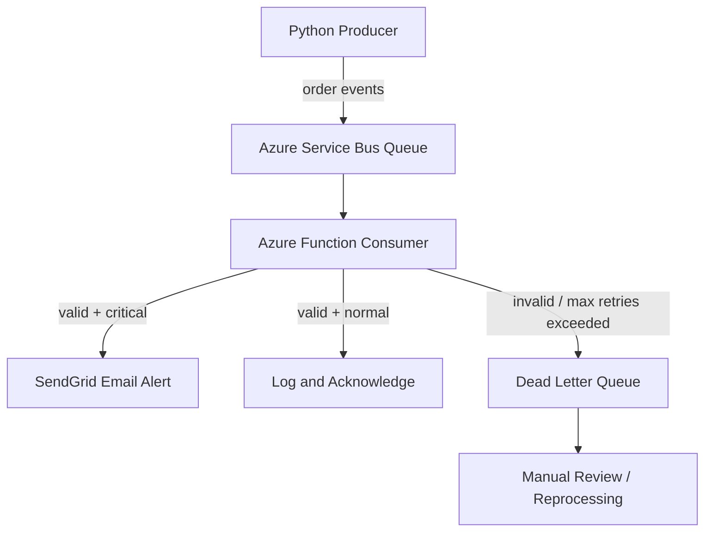

# Real-Time Order Alert System

[](https://github.com/SangaviKS/alert-system-project/actions/workflows/ci.yml)

An event-driven order alert system built on Azure Service Bus and Azure
Functions, with dead letter queue handling, retry logic, and SendGrid
email alerts for critical order events.

## Architecture



## Features
- Cloud-agnostic core event module reusable across Azure and AWS
- Producer sends order events with statuses: placed, failed, cancelled, processing
- Azure Function consumer validates, classifies, and routes events by business rules
- Critical events (failed/cancelled) trigger immediate SendGrid email alerts
- Automatic retry logic — messages exceeding 3 delivery attempts routed to dead letter queue
- Dead letter queue captures unprocessable messages for manual review
- 24 pytest unit tests covering event generation, validation, retry logic, and classification
- GitHub Actions CI pipeline running tests on Python 3.11 and 3.12

## Tech Stack
- **Language:** Python 3.14
- **Messaging:** Azure Service Bus (Standard tier)
- **Compute:** Azure Functions v1 model (Service Bus trigger)
- **Alerting:** SendGrid
- **Testing:** pytest, pytest-cov
- **CI/CD:** GitHub Actions

## Project Structure
```text
3_alert-system/
├── core/
│   └── order_event.py              # Cloud-agnostic event logic
├── azure/
│   ├── producer.py                 # Sends order events to Service Bus
│   └── function_app/
│       ├── process_order_event/
│       │   ├── __init__.py         # Azure Function consumer
│       │   └── function.json       # Service Bus trigger binding
│       ├── host.json
│       ├── extensions.csproj       # Service Bus extension registration
│       └── requirements.txt
├── aws/                            # AWS layer (in progress)
├── tests/
│   └── test_order_event.py         # 24 unit tests
├── .github/workflows/
│   └── ci.yml                      # GitHub Actions CI pipeline
├── README.md
└── requirements.txt
```

## Screenshots

### Producer Terminal


### Critical Alert Email


### Service Bus Explorer


### Dead Letter Queue


## How to Run

### Prerequisites
```bash
git clone https://github.com/SangaviKS/alert-system-project.git
cd alert-system-project
python3 -m venv venv
source venv/bin/activate
pip install -r requirements.txt
```

### Environment Variables
Create a `.env` file:
```
AZURE_SERVICE_BUS_CONNECTION_STRING=your-connection-string
AZURE_SERVICE_BUS_QUEUE_NAME=order-events
SENDGRID_API_KEY=your-api-key
ALERT_EMAIL_TO=your-email
ALERT_EMAIL_FROM=your-verified-sender
```

### Run the Producer
```bash
python3 azure/producer.py
```

### Run the Azure Function Locally
```bash
cd azure/function_app
func start
```

### Run Tests
```bash
pytest tests/ --cov=core --cov-report=term-missing -v
```

## Setup Notes

### Azure Functions v1 vs v2 Programming Model
The Azure Functions Python v2 programming model (decorator-based, using
`app = func.FunctionApp()`) has a known incompatibility with Service Bus
trigger registration in Azure Functions Core Tools 4.x local development.
The v2 model fails with `serviceBusTrigger not registered` even after
installing the Service Bus extension via `extensions.csproj`. Resolved by
switching to the v1 programming model (`function.json` binding declarations
+ `def main(msg)` entry point), which has reliable local Service Bus
trigger support.

### Azure Functions Local Package Resolution
Azure Functions Core Tools local runtime resolves Python packages from
`.python_packages/lib/python3.14/site-packages/` inside the function app
directory — not from the project's virtual environment. This required:
- Installing packages with `pip install --target=".python_packages/lib/python3.14/site-packages"`
- Setting `PYTHONPATH` in `local.settings.json` to point to this folder
- Adding `.python_packages/` to `.gitignore`

### SSL Certificate Verification (Python 3.14 + macOS)
Python 3.14 on macOS doesn't use system SSL certificates by default,
causing SSL verification failures when the Azure Functions runtime makes
outbound HTTPS calls (e.g. to SendGrid). Resolved by setting
`SSL_CERT_FILE` and `REQUESTS_CA_BUNDLE` environment variables in
`local.settings.json` using the certifi bundle path, and reinforcing
this inside `send_critical_alert()` via `os.environ` before each
SendGrid API call.

### local/azure Namespace Conflict
Python's namespace package resolution picks up any local directory named
`azure/` before the installed `azure-servicebus` SDK, causing
`ModuleNotFoundError` despite the package being correctly installed.
Resolved by removing `__init__.py` from the local `azure/` directory,
preventing Python from treating it as a package.

### SendGrid Spam Filtering
Emails from newly verified SendGrid sender accounts are commonly flagged
as spam by Gmail and other providers until the sender builds a delivery
reputation. Confirmed delivery via SendGrid Email logs (all emails
showed "Delivered" status) — emails were present in spam folder and
marked safe. For production use, SendGrid domain authentication would
resolve this.

## What I Learned
- Event-driven architecture with decoupled producers and consumers
- Dead letter queue patterns for handling unprocessable messages
- Retry logic design — when to retry vs when to dead letter
- Azure Functions Service Bus trigger and message lifecycle management
- Differences between Azure Functions v1 and v2 programming models
  and their local development compatibility trade-offs
- Azure Functions local runtime package resolution vs standard venv
- Classifying and routing events based on business rules
- Integrating transactional email (SendGrid) into serverless functions
- Diagnosing and resolving SSL certificate verification failures inside
  a managed runtime environment
- Python namespace conflicts between local folder names and installed SDKs