# Real-Time Order Alert System

[](https://github.com/SangaviKS/alert-system-project/actions/workflows/ci.yml)

An event-driven order alert system built on both Azure and AWS, with
decoupled producer/consumer architecture, business-rule-based event
routing, automatic retry logic, dead letter queue handling, and email
alerts for critical order events.

## Architecture

### Azure Pipeline
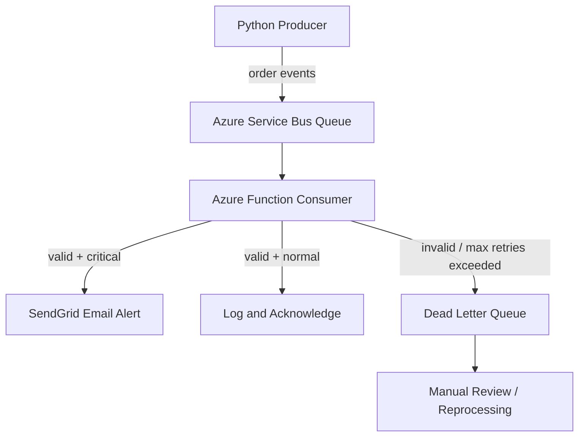

### AWS Pipeline
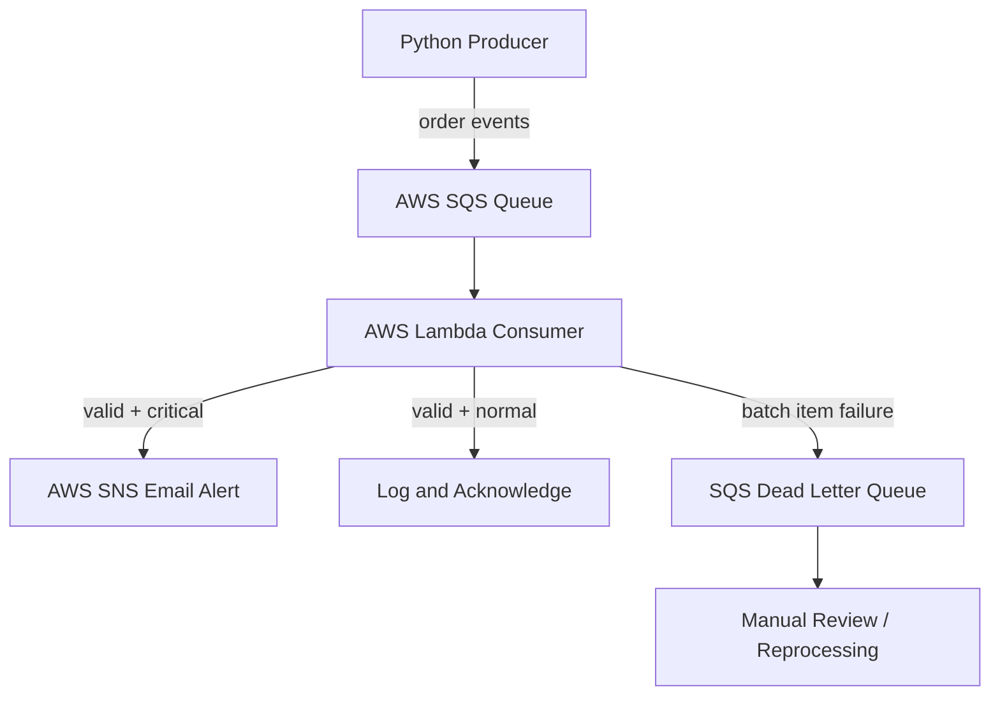

## Features

### Shared
- Cloud-agnostic core event module (`core/order_event.py`) reusable
  across Azure and AWS
- Same business logic (validation, classification, retry) runs on
  both cloud platforms
- 24 pytest unit tests covering all core logic
- GitHub Actions CI pipeline on Python 3.11 and 3.12

### Azure
- Producer sends order events to Azure Service Bus queue
- Azure Function consumer (v1 model) validates and routes events
- Critical events trigger SendGrid transactional email alerts
- Dead letter queue captures messages exceeding 3 delivery attempts

### AWS
- Producer sends order events to AWS SQS queue
- AWS Lambda consumer processes events with batch item failure reporting
- Critical events trigger AWS SNS email alerts
- SQS Dead Letter Queue captures failed messages automatically

## Tech Stack

### Azure
- **Messaging:** Azure Service Bus (Standard tier)
- **Compute:** Azure Functions v1 model (Service Bus trigger)
- **Alerting:** SendGrid

### AWS
- **Messaging:** AWS SQS (Standard queue + DLQ)
- **Compute:** AWS Lambda (SQS trigger, arm64)
- **Alerting:** AWS SNS

### Shared
- **Language:** Python 3.14
- **Testing:** pytest, pytest-cov
- **CI/CD:** GitHub Actions

## Project Structure
```text
3_alert-system/
├── core/
│   └── order_event.py              # Cloud-agnostic event logic
├── azure/
│   ├── producer.py                 # Sends events to Azure Service Bus
│   └── function_app/
│       ├── process_order_event/
│       │   ├── __init__.py         # Azure Function consumer
│       │   └── function.json       # Service Bus trigger binding
│       ├── host.json
│       ├── extensions.csproj
│       └── requirements.txt
├── aws/
│   ├── producer.py                 # Sends events to AWS SQS
│   └── lambda_function.py         # AWS Lambda consumer (reference copy)
├── tests/
│   └── test_order_event.py         # 24 unit tests
├── .github/workflows/
│   └── ci.yml                      # GitHub Actions CI pipeline
├── README.md
└── requirements.txt
```

## Screenshots

### Azure Pipeline

#### Producer Terminal
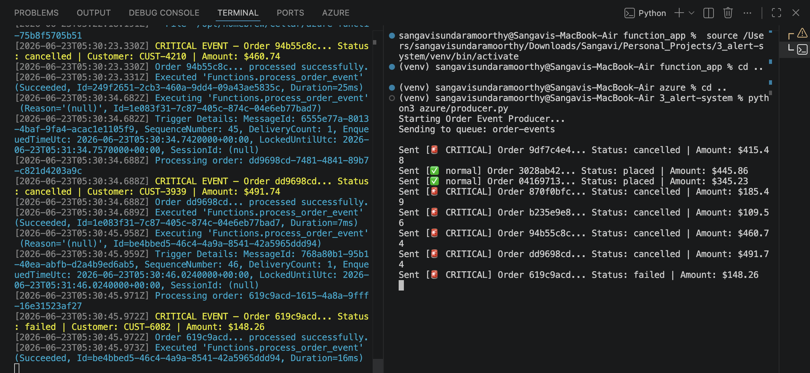

#### Critical Alert Email (SendGrid)
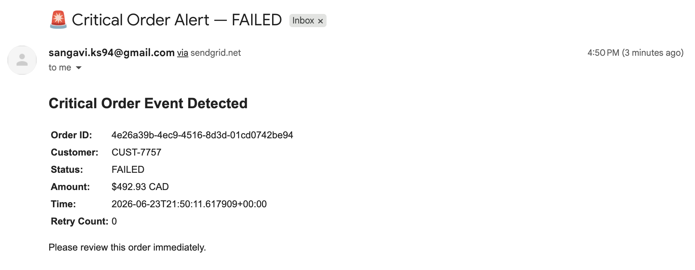

#### Service Bus Explorer
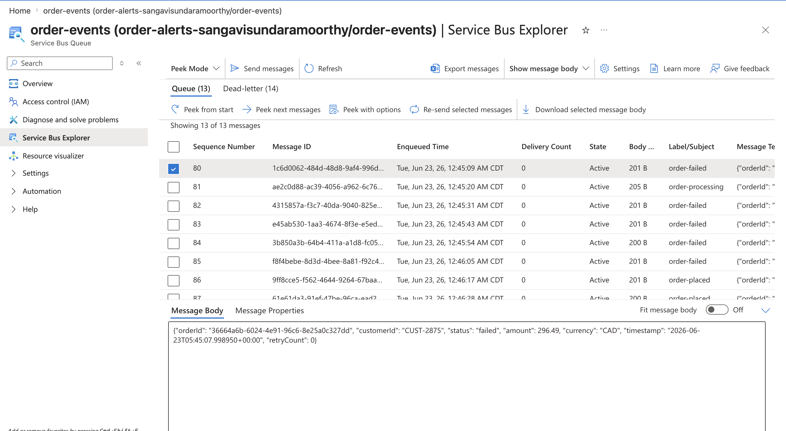

#### Dead Letter Queue
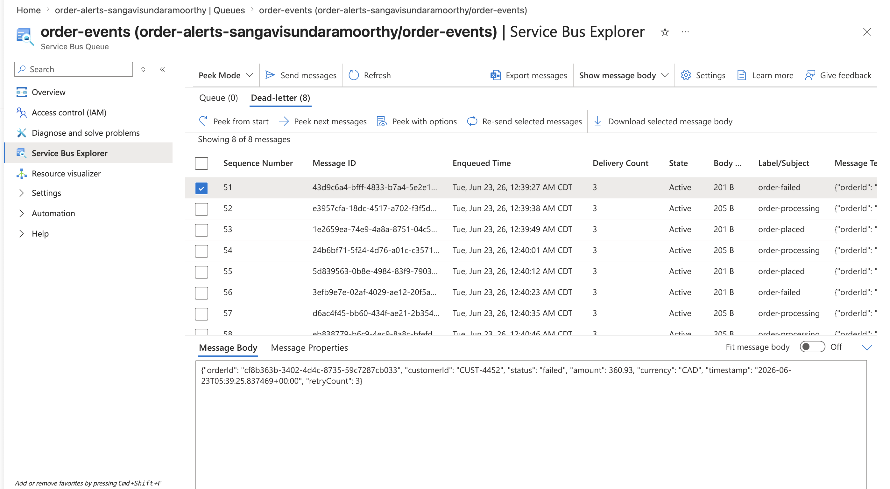

### AWS Pipeline

#### AWS SQS Queue
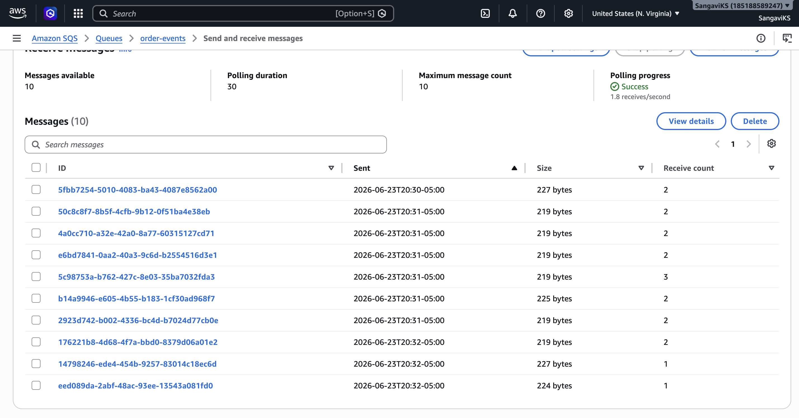

#### AWS Lambda CloudWatch Logs
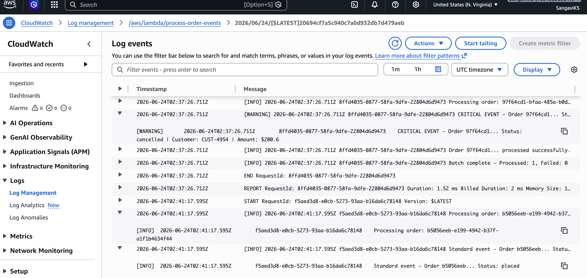

#### AWS DLQ
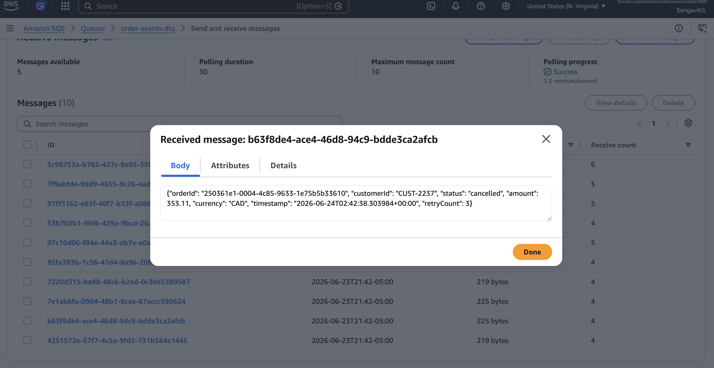

#### AWS SNS Alert Sent (CloudWatch)
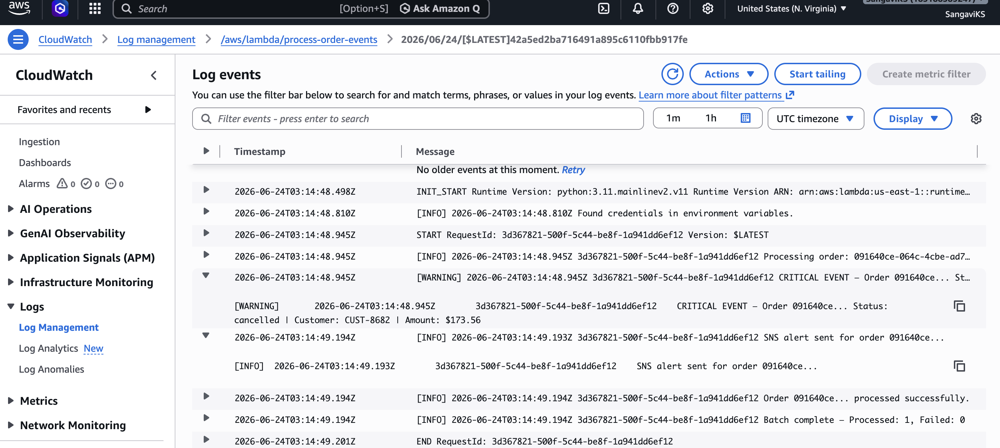

#### AWS SNS Alert Email
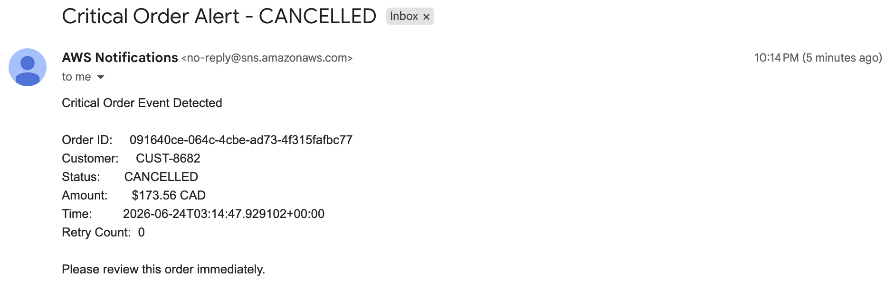

## How to Run

### Prerequisites
```bash
git clone https://github.com/SangaviKS/alert-system-project.git
cd alert-system-project
python3 -m venv venv
source venv/bin/activate
pip install -r requirements.txt
```

### Environment Variables
Create a `.env` file:
```
# Azure
AZURE_SERVICE_BUS_CONNECTION_STRING=your-connection-string
AZURE_SERVICE_BUS_QUEUE_NAME=order-events
SENDGRID_API_KEY=your-api-key
ALERT_EMAIL_TO=your-email
ALERT_EMAIL_FROM=your-verified-sender

# AWS
AWS_ACCESS_KEY_ID=your-access-key
AWS_SECRET_ACCESS_KEY=your-secret-key
AWS_DEFAULT_REGION=us-east-1
AWS_SQS_QUEUE_URL=https://sqs.us-east-1.amazonaws.com/your-account/order-events
AWS_SQS_DLQ_URL=https://sqs.us-east-1.amazonaws.com/your-account/order-events-dlq
AWS_SNS_TOPIC_ARN=arn:aws:sns:us-east-1:your-account:order-critical-alerts
```

### Run Azure Producer
```bash
python3 azure/producer.py
```

### Run Azure Function Locally
```bash
cd azure/function_app
func start
```

### Run AWS Producer
```bash
python3 aws/producer.py
```

### Run Both Simultaneously
```bash
# Terminal 1
python3 azure/producer.py

# Terminal 2
python3 aws/producer.py
```

### Run Tests
```bash
pytest tests/ --cov=core --cov-report=term-missing -v
```

## Cost

### Azure
| Service | Cost |
|---|---|
| Azure Service Bus Standard tier | ~$0.10/month at low volume |
| Azure Functions consumption plan | Free (1M executions/month) |
| SendGrid free tier | $0 (100 emails/day) |
| **Total** | **~$0.10/month** |

### AWS
| Service | Cost |
|---|---|
| AWS SQS | Free (1M requests/month) |
| AWS Lambda | Free (1M invocations/month) |
| AWS SNS | Free (1M notifications/month) |
| **Total** | **$0/month** |

## Setup Notes

### Azure Functions v1 vs v2 Programming Model
The Azure Functions Python v2 programming model has a known
incompatibility with Service Bus trigger registration in Azure Functions
Core Tools 4.x local development. Switched to v1 model (`function.json`
binding declarations + `def main(msg)` entry point) which has reliable
local Service Bus trigger support.

### Azure Functions Local Package Resolution
Azure Functions Core Tools local runtime resolves Python packages from
`.python_packages/lib/python3.14/site-packages/` — not from the project
venv. Required installing packages with `pip install --target` and setting
`PYTHONPATH` in `local.settings.json`.

### SSL Certificate Verification (Python 3.14 + macOS)
Python 3.14 on macOS causes SSL verification failures for outbound HTTPS
calls inside the Azure Functions runtime. Resolved by setting
`SSL_CERT_FILE` and `REQUESTS_CA_BUNDLE` in `local.settings.json` and
reinforcing via `os.environ` inside `send_critical_alert()`.

### local/azure Namespace Conflict
Local `azure/` directory shadowed the installed `azure-servicebus` SDK.
Resolved by removing `__init__.py` from the local `azure/` directory.

### SNS Subscription Confirmation
AWS SNS silently drops messages to unconfirmed email subscriptions with
no error — CloudWatch logs show successful publish but emails don't
arrive. Always confirm the subscription email before testing end-to-end.

### SendGrid Spam Filtering
Emails from new SendGrid sender accounts land in spam until the sender
builds a delivery reputation. Confirmed via SendGrid Activity Feed and
marked as safe.

## What I Learned

### Azure
- Event-driven architecture with decoupled producers and consumers
- Azure Functions v1 vs v2 programming model trade-offs
- Azure Functions local runtime package resolution
- Dead letter queue patterns for unprocessable messages
- SSL certificate handling inside managed runtime environments
- Python namespace conflicts with installed SDKs

### AWS
- SQS queue configuration with companion dead letter queues
- Lambda batch item failure reporting for partial batch failures
- SNS topic subscription lifecycle and confirmation requirements
- IAM permission management across Lambda, SQS, and SNS
- Diagnosing silent failures (SNS subscription not confirmed)

### Both
- Cloud-agnostic core module design enabling code reuse across platforms
- Retry logic design — when to retry vs when to dead letter
- Business-rule-based event routing and classification
- Comparing Azure and AWS messaging/compute/alerting service patterns